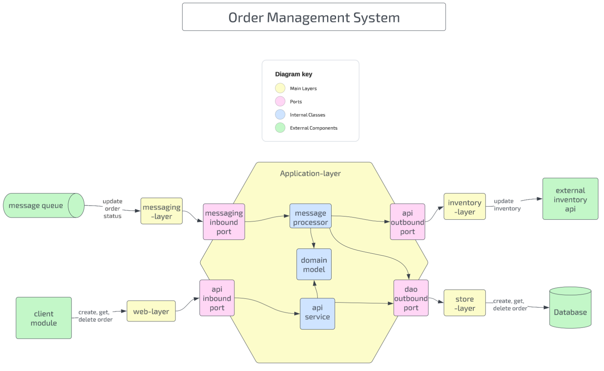

# 🧩 Order Management System

## Overview
The **Order Management System (OMS)** is designed following the **Hexagonal Architecture (Ports and Adapters)** pattern to ensure clear separation between core business logic and external systems.  
It handles operations such as creating, fetching, and deleting orders, as well as processing domain events and interacting with external services like inventory.

---

## 🏗️ Architecture

The system is structured into **five main layers**:

### 1. Web Layer
- Intercepts client requests to **create**, **fetch**, and **delete** orders.
- Exposes REST endpoints for external consumers.

### 2. Messaging Layer
- Consumes and processes the **domain event** `status update`.
- Integrates with the event broker to react to asynchronous updates.

### 3. Store Layer
- Orchestrates access to the **database**.
- Manages persistence and retrieval of domain entities.

### 4. Inventory Layer
- Notifies the **Inventory Service** by performing REST API calls.
- Keeps inventory data consistent with order lifecycle changes.

### 5. Application Layer
- Contains the **core domain logic** and **domain models**.
- Isolated from the other layers, which can interact with it **only through the port classes**, representing the external gates of the Hexagonal Architecture.

---

## 🔧 Technology

| Component                | Technology     |
| ------------------------ | -------------- |
| **Programming Language** | Java 21        |
| **Backend Framework**    | Spring Boot    |
| **Database**             | H2             |
| **Application Server**   | Tomcat         |
| **Testing**              | JUnit, Mockito |

---

## 💻 Getting Started

### Clone the repository
git clone https://github.com/your-username/order-management-system.git

### Navigate to project folder
cd order-management-system

### Build the project
./mvnw clean package

### Run the application
java -jar target/order-management-system.jar

### Run Tests
./mvnw test

